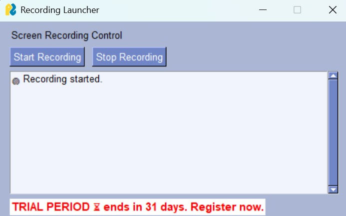
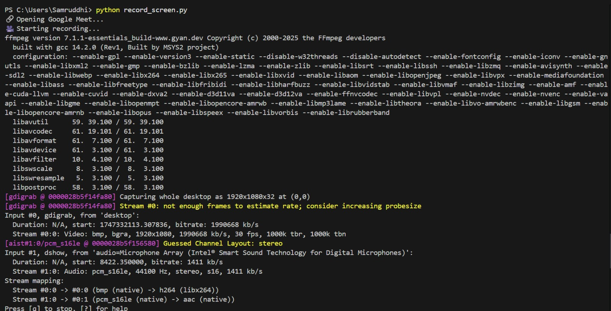
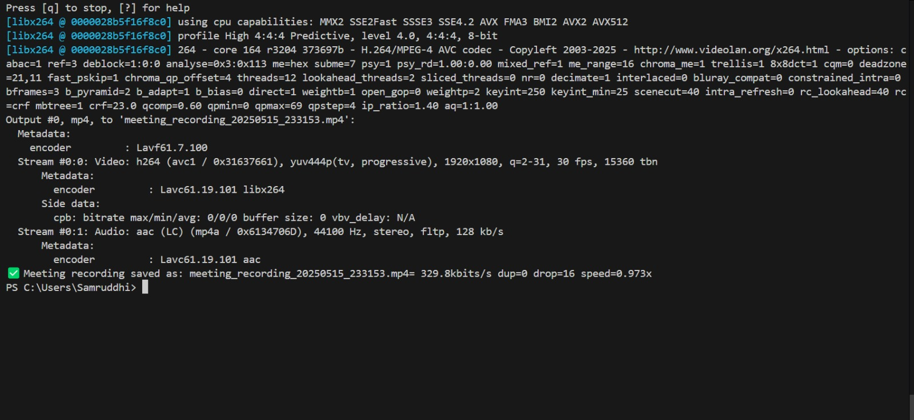

# MeetingAssistant

[](https://pypi.org/project/MeetingAssistant/)
[](https://pypi.org/project/MeetingAssistant/)

**MeetingAssistant** is a local meeting workspace for turning recordings into transcripts, summaries, and searchable meeting notes. The current codebase centers on three working flows: process a recording in the desktop app, capture meetings through Telegram, and search the saved archive with semantic retrieval.


## Key Features

- 🎙️ **Local Transcription** - Whisper.cpp converts audio and video into `transcript.txt`
- 📝 **Local Summarization** - llama.cpp with a GGUF model creates concise meeting summaries
- 🔍 **Semantic Search** - FAISS indexes saved summaries for later retrieval
- 🤖 **Multi-Interface** - Desktop GUI plus a Telegram bot for capture and search
- 🧠 **Structured Queries** - The UI extracts dates, actions, and topics from search text
- 📁 **Persistent Archive** - Meetings are stored in dated folders with source media and notes

## Screenshots / Demo

<div align="center">
  
  <br>
  <em>Desktop Interface - Manage meetings and search through transcripts</em>
</div>


<div align="center">
  
  <br>
  <em>Telegram Bot - Process voice notes and query meetings on mobile</em>
</div>


  
<div align="center">
  <table>
    <tr>
      <td align="center">
        
        <br>
        <strong>Live Transcription</strong>
      </td>
    </tr>
  </table>
</div> 


### 🖥️ Screen Recording Workflow

<div align="center">
  
  <br>
  <em>Recording Interface - Launch screen recordings directly from the GUI</em>
</div>

<div align="center">
  <table>
    <tr>
      <td align="center">
        
        <br>
        <strong>Recording Initialization</strong>
        <br>
        Console output showing FFmpeg configuration
      </td>
      <td align="center">
        
        <br>
        <strong>Recording Completion</strong>
        <br>
        Successful meeting capture confirmation
      </td>
    </tr>
  </table>
</div>

### Key Technical Specifications
```bash
# Example recording command
ffmpeg -f gdigrab -framerate 30 -i desktop -f dshow -i audio="Microphone Array" \
       -c:v libx264 -preset ultrafast -crf 23 -c:a aac -b:a 128k output.mp4
```

## Working Features

- Desktop meeting processing: choose an audio or video file, copy it into a dated meeting folder, transcribe it, summarize it, and refresh the FAISS index.
- Telegram bot intake: accept audio, voice, and video messages, generate a transcript and summary, save them under the meeting archive, and reply with the results.
- Semantic search: build a FAISS index from saved `summary.txt` files and query similar meetings later.
- Query parsing: extract dates, verbs, and topical entities from search text so the UI can surface a structured view of what was asked.
- Local model pipeline: whisper.cpp handles transcription, and llama.cpp with a GGUF model handles summarization.
- Persistent archive: every meeting is written to `meetings/YYYY/MM/DD-title/` with the raw media, transcript, and summary files.

## How The Pipeline Works

1. Add a recording in the desktop app or send one to the Telegram bot.
2. The app stores the source media in a dated meeting folder.
3. Whisper.cpp creates `transcript.txt`.
4. The summarizer creates `summary.txt`.
5. `build_faiss_index()` scans saved meetings and refreshes the search index in `index/`.
6. Search queries retrieve the closest meetings and surface the saved content.

## Data Layout

- `meetings/YYYY/MM/DD-title/` stores the source file, transcript, and summary for each meeting.
- `index/faiss.index` stores the FAISS vector index.
- `index/metadata.pkl` stores the metadata needed to map search hits back to meeting folders.

## Project Focus

The current implementation is centered on the desktop GUI and the Telegram bot flow. The desktop app is the quickest way to process a recording and refresh search, while the bot is the lightweight way to capture meetings on mobile and archive them automatically.

## License
MIT License - See LICENSE for details

This project is licensed under the [MIT License](LICENSE). All code, documentation, and data formats are available under MIT terms.

## Acknowledgments:
MeetingAssistant leverages [whisper.cpp](https://github.com/ggerganov/whisper.cpp) for transcription, [llama.cpp](https://github.com/ggerganov/llama.cpp) for local summarization, and [FAISS](https://github.com/facebookresearch/faiss) for semantic search indexing. These components power the recording, summarization, and retrieval flows used throughout the project.
